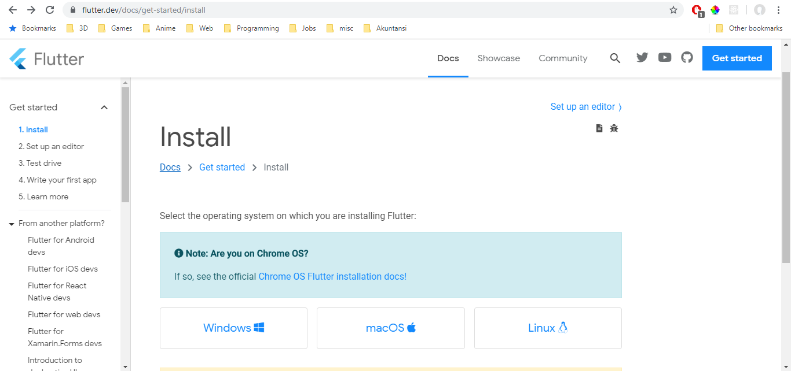

# Installasi Flutter
Cara installasi Flutter tanpa Android Studio

- Download SDK Flutter. Silahkan kunjungi halaman [download disini](https://flutter.dev/docs/get-started/install), dan sesuaikan dengan sistem operasi kalian. Saat tulisan ini dibuat, versi terakhir Flutter adalah 1.9.1 Stable 
- Selanjutnya silahkan download Command Line Tools Only [di halaman ini](https://developer.android.com/studio/#command-tools). Silahkan download sesuai sistem operasi yang digunakan. 
- Jika sudah di download, extract kedua zip tersebut dan taruh di folder yang kalian mau, namun usahakan taruh di satu folder agar terlihat rapih. Untuk saya sendiri, saya manaruhnya di `C:\tools\android`. Jadi di dalam folder tersebut. 
- Jika sudah memiliki JDK 8 atau OpenJDK 8, maka langkah ini bisa di
lompati. Download OpenJDK [di sini](https://github.com/AdoptOpenJDK/openjdk8-binaries/releases). Tidak ada perbedaan signifikan antara JDK dan OpenJDK. Di bawah tulisan assets, pilih .zip yang sesuai dengan sistem operasi anda. 
- Kemudian, set path di environment variable agar command yang kita perlukan dalam development flutter **dapat terdeteksi** oleh Command Prompt/Terminal.
  - Buka control panel
  - Pergi menuju `System and Security -> System -> Advanced System Settings`  
  - Di tab `Advanced`, tekan tombol `Environment Variables` 
  - Di bagian `System Variables`, tekan New, kemudian masukan sesuai gambar di bawah ini. 
  - Di bagian `System Variables`, pilih Path, kemudian tekan `Edit`. 
  - Tekan new, kemudian masukan path folder untuk flutter (value lihat di bawah). Lakukan hal yang sama untuk command line tools dan openjdk/jdk. (Jika JDK sudah ada, tidak perlu menambahkannya lagi di path)  
    > setx path memiliki masalah di Windows 7 (trimmed), jadi lebih disarankan untuk mengeditnya manual di sini.
  - Tekan OK jika sudah selesai.
  - Jalankan Command Prompt/Terminal, kemudian jalankan `sdkmanager --version` dan `flutter --version` untuk mengecek apakah perintahnya dikenali atau tidak. Jika tidak, maka silahkan restart PC anda. Jika masih tidak bisa, maka cek ulang di Path tadi apakah ada typo atau salah input. 
- Jalankan perintah di bawah ini untuk menginstall SDK Android:
  - Windows: `sdkmanager “system-images;android-28;default;x86_64” sdkmanager “platform-tools” sdkmanager “build-tools;28.0.3” sdkmanager “platforms;android-28”` 
  - Mac: `sdkmanager ‘system-images;android-28;default;x86_64’`
- Flutter selalu memerlukan SDK yang terbaru, jadi silahkan anda update dengan menjalankan command `sdkmanager --update`. 
- Jalankan perintah `flutter doctor --android-licenses` untuk accept lisensi Android. 
- Install VSCode ([di sini](https://code.visualstudio.com/)) beserta extension Flutter dan Dart. 
    > Untuk menginstall extension Flutter, silahkan tekan `Ctrl+Shift+X` (mac `Cmd+Shift+X`), lalu cari flutter, kemudian tekan install. Sama halnya dengan extension Dart.  
- Jika semuannya sudah selesai, jalankan perintah `flutter doctor` 

